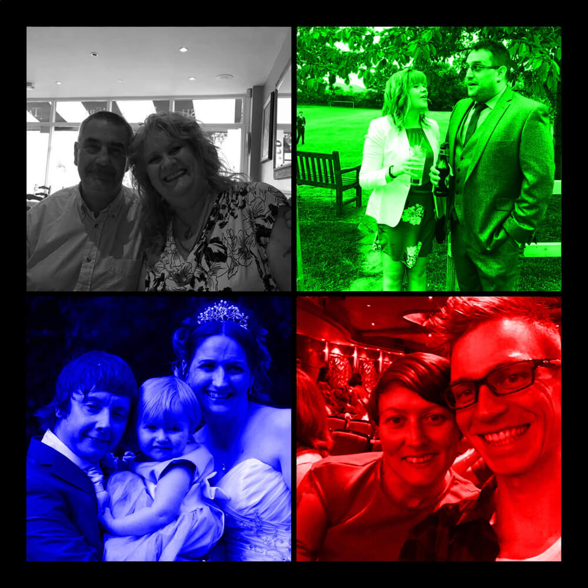
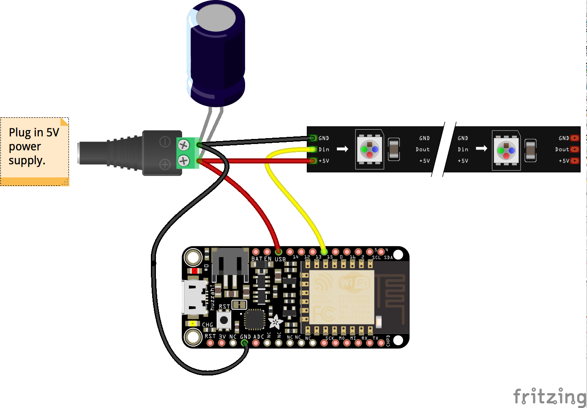

Clantastic
==========

A maker project designed to bring the family together (via spying).

Concept
-------

My immediate family is separated into four discrete units:

- My parents
- My girlfriend Lucy and I
- My sister Jessica, her husband Chris, and her daughter Alicia
- My sister Emily, and her boyfriend James

From a very early age Emily has associated herself with the colour red, Jessica is somewhat partial to blue, and (via accident or fate) I've ended up with the moniker _Lime Blast_.

With this in mind, I thought it would be cool to present my parents with a framed image, split into quarters for each of these family units highlighted in their signature colour.

Further to this, because I'm amazed by the level of connectivity the internet provides, I thought it would be even cooler if the intensity of these respective colours was generated by a _satellite_ unit in each of my siblings abodes, with the combination of these colours going on to provide the colour of my parents.

For example, if you mix 100% red, and 100% green, but 0% blue, you get yellow. Meaning, if both Emily and myself are super active, generating lots of input for our satellite boxes, but Jessica is taking a day off, Jessica's quarter would be a very dull blue, Emily's would be a bright red, mine a bright green, and my parents' a bright yellow.

### But, why?

This project serves no practical use, other than (what I hope will be) a really cool present for the members of my family, and an excuse for me to learn and flex my maker skills.

Devices
-------

### Base frame

This is powered by a Feather Huzzah which uses data obtained via MQTT to run some WS2812 RGB LEDs.

